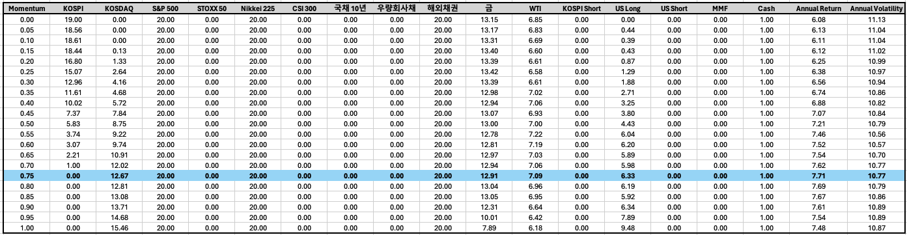
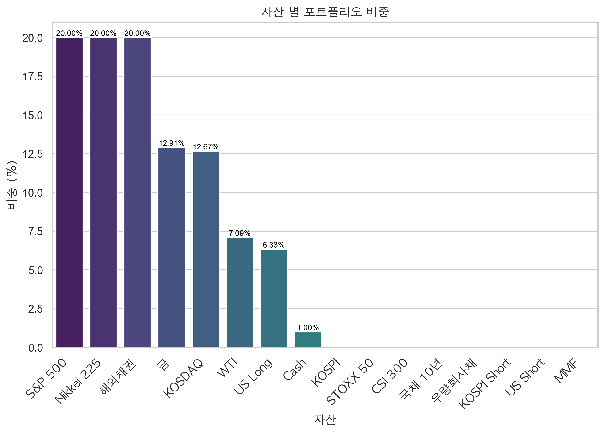
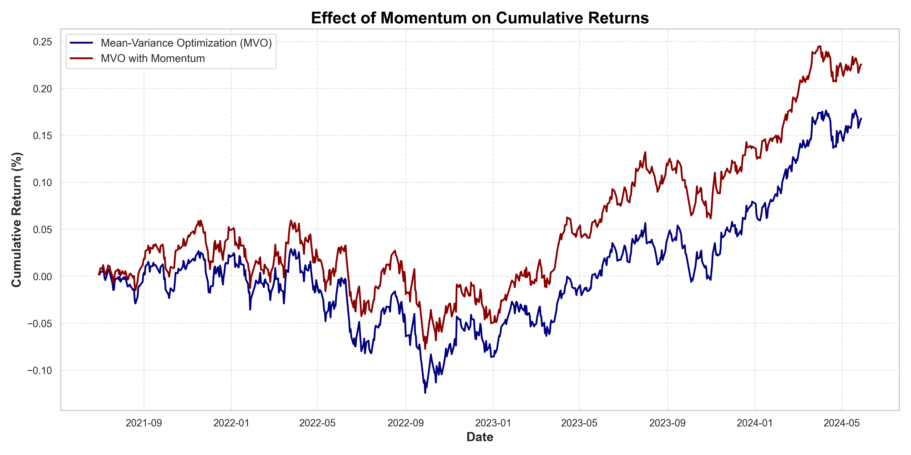

# DB GAPS Investment Competition 

This repository contains code and data for portfolio optimization using Mean-Variance Optimization (MVO) enhanced with momentum factors. The project includes transaction costs for the rebalancing process in the optimization. This project is developed for the DB GAPS Investment Competition.

## Overview

This project aims to find an optimal portfolio allocation by combining Mean-Variance Optimization and momentum strategies. The optimization process includes transaction costs to account for the cost of rebalancing the portfolio.

## Data

The project includes the following data files:
- `FnGuide Data MMDD.csv`: Financial data as of the date(MMDD) provided

## Results

### MVO and Momentum Factor Results

The table below shows the optimal portfolio weights for various momentum factors:



### Initial Allocation

The initial asset allocation based on the optimization strategy is illustrated in the bar chart below:



### Effect of Momentum on Cumulative Returns

The cumulative returns of the portfolio using traditional MVO versus MVO enhanced with momentum are shown in the following chart:



## Installation

1. Clone the repository:
    ```bash
    git clone https://github.com/USERNAME/DB_GAPS_Portfolio_Allocation.git
    cd DB_GAPS_Portfolio_Allocation
    ```

2. Set up a virtual environment (optional but recommended):
    ```bash
    python -m venv env
    source env/bin/activate  # On Windows use `env\Scripts\activate`
    ```

## Usage

### Configuration

Edit the `config.py` file to set your desired parameters, including the split date, file paths, column names, and other configuration settings.

### Running the Optimization

To run the portfolio optimization, execute the `main.py` script:
```bash
python main.py
``` 

## Project Structure 
	•	main.py: Orchestrates the workflow for portfolio optimization.
	•	config.py: Contains configuration settings and parameters.
	•	data_processing.py: Handles data loading and preprocessing.
	•	optimization.py: Contains optimization logic including transaction cost adjustments.
	•	performance.py: Calculates performance metrics for the portfolio.
	•	plot.ipynb: Jupyter notebook for generating plots and visualizations.
	•	mvo_momentum_df.csv: CSV file with momentum data.